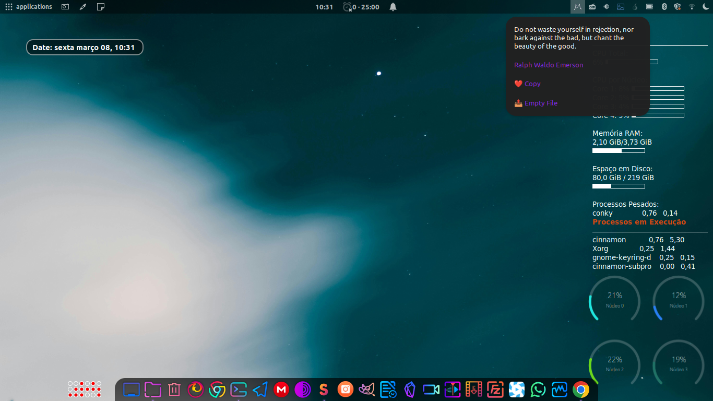

# BillionsMindset Applet for Linux Mint

## Description

Welcome to the BillionsMindset Applet! This applet is designed to provide you with inspirational quotes that align with the mindset of abundance and wealth building.

The phrase that represents the spirit of this applet is: "O dinheiro vem até mim em quantidades cada vez maiores, de diversas fontes e continuas bases, e comigo fica para construção da minha riqueza." which translates to "Money comes to me in increasing amounts, from various sources and continuous streams, and stays with me for the construction of my wealth."

## Usage

Simply click on the applet to receive a random quote that will inspire and motivate you. The applet displays the quote and author, allowing you to copy it to your clipboard or save it to a text file on your desktop.

## Important Notice

**Copyright and Usage Restriction:**
This applet is protected by copyright, and all rights are reserved by the author, @wmprado__. You are welcome to use and enjoy this applet for personal and non-commercial purposes. However, any form of commercial use, including selling or incorporating this applet into commercial projects, is strictly prohibited without explicit permission from the author.

**Contact for Commercial Usage:**
If you are interested in using this applet for commercial purposes or have inquiries about larger projects, please feel free to contact the author via [GitHub](https://github.com/wmprado/BillionsMindset/).

## Installation

1. Clone or download the repository: [BillionsMindset GitHub](https://github.com/wmprado/BillionsMindset/)
2. Copy the contents to the `.local/share/cinnamon/applets/BillionsMindset@Prado` directory.

## Version Information

- Version: 1.0
- Author: @wmprado__
- Website: [BillionsMindset GitHub](https://github.com/wmprado/BillionsMindset/)

Enjoy the journey towards abundance and wealth building with the BillionsMindset Applet!
